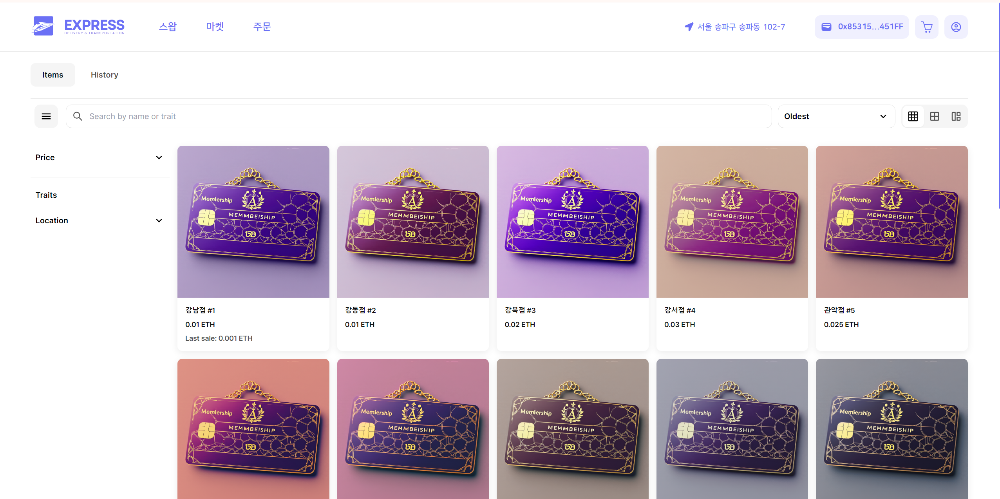
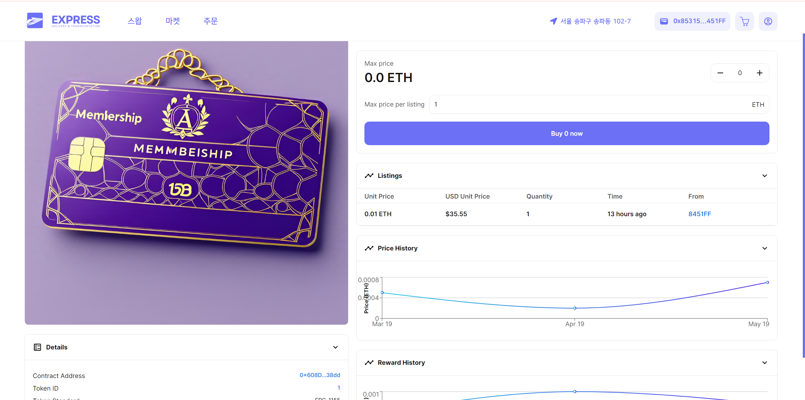
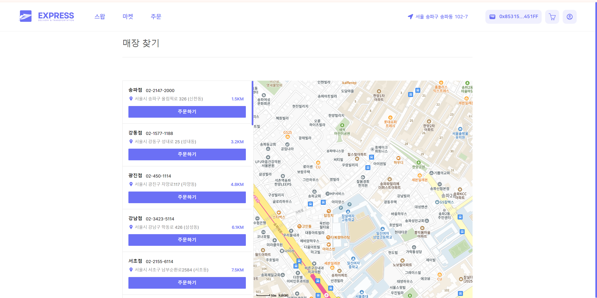
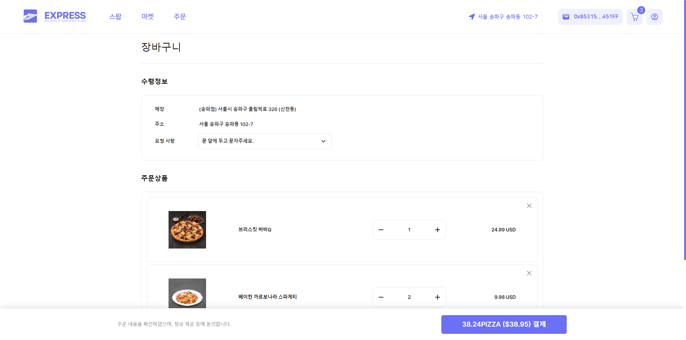
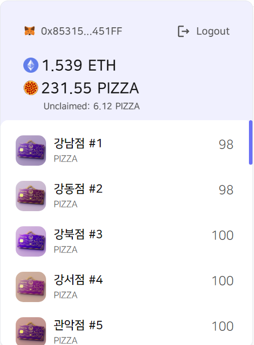

# Franchise NFT Project

- 프로젝트 URL

```
https://franchise-kappa.vercel.app/
```

- GitHub URL

```
https://github.com/asm9677/franchise-nft
```

- 프로젝트 소개

  Franchise NFT는 사업자가 매장을 확장 할때 매장의 대한 권리를 NFT로 만들고 이를 판매함으로써 사업자는 매장 확장에 대한 리스크를 분담하고 투자자는 NFT를 보유하여 컨트랙트 코드에 의해 매장 수익의 일부를 자동으로 제공받는 프로젝트입니다.

- 기획의도

  블록체인 기술의 투명성과 신뢰성을 활용하여
  투자자에게는 매장의 수익을 투명하게 제공하고, 오너에게는 사업 확장에 대한 리스크를 줄여주고자 기획하게 되었습니다.

- 주요기능

  1. Uniswap Router를 사용하여 ETH를 상품을 구매할 수 있는 토큰인 PIZZA로 교환하거나 PIZZA 토큰을 다시 ETH으로 바꿀 수 있습니다.

  

  2. 발행된 NFT 목록을 보여주고 판매 등록 및 판매 내역을 보여줍니다.

  

  3. NFT 상세페이지에서는 토큰을 구매할 수 있으며 토큰 가격 및 보유 시 받는 리워드를 차트로 보여줍니다.

  

  4. kakaomap api를 사용하여 사용자의 주변 매장 정보를 보여줍니다.

  

  5. Chain link api를 사용하여 블록체인으로부터 환율 정보를 받아오고 상품의 가격을 환율에 맞게 적용하여 ERC-20 토큰으로 결제합니다.

  

  6. 사용자가 보유중인 ETH 및 ERC-20토큰, NFT, 그리고 보유중인 NFT를 통해 받게 될 보상 정보를 출력해줍니다.

  

- 특이사항

  - **블록체인 연동**: Ethers.js를 사용하여 블록체인과 상호작용하는 코드를 작성, 스마트 계약을 통해 NFT를 발행 및 관리하였습니다.

  - **기술 스택**: 프로젝트 전반에 걸쳐 React와 TypeScript를 사용하여 안정적이고 유지보수하기 쉬운 코드를 작성하였습니다.

  - **디자인 도구**: Canva를 사용하여 NFT 이미지와 로고를 제작하였습니다.

- 회고

  - **아쉬운 점**

    - **접근성**: 모든 상품 결제가 블록체인에서 상에서 이루어져야 하기 때문에 실제로 사용되기에는 어려울 것 같습니다.

    - **UI/UX**: NFT 거래와 상품 결제가 같은 사이트에서 이루어지기 때문에 사용자가 사용할 때 많은 혼란을 느낄거 같습니다. 또한, 기존에 있던 사이트를 많이 참고하여서 개성이 많이 부족한 것 같습니다.

    - **최적화**: 백엔드를 사용하지 않다보니 불필요한 정보를 블록체인에 많이 저장하게 되었고, 이로 인해 불필요한 가스 소모가 이루어졌습니다.

    - **코드 관리**: 기능 구현에만 초점을 두고 개발하다보니 스파게티 코드가 된 코드를 방치하게 되었고 유지보수에 많은 어려움이 있을 것으로 예상됩니다.

  - **잘한 점**

    - **기술 적용**: 각 기능에 맞게 컨트랙트를 세분화하여 오류없이 기능이 동작하게 하였습니다.

    - **많은 기능 구현**: 짧은 시간동안 배운 내용을 최대한 적용하여 많은 기능들을 구현하였습니다.
